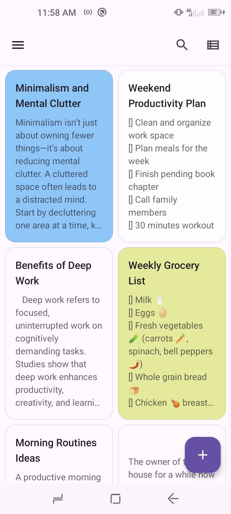
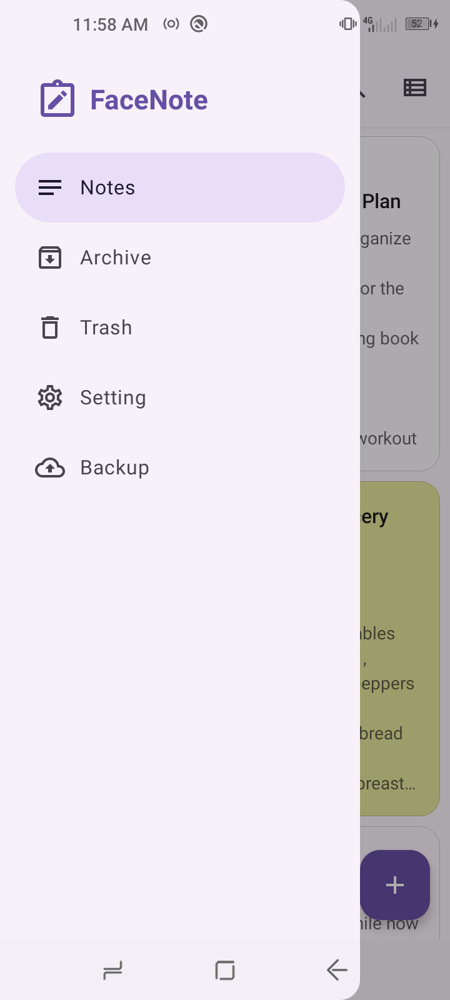
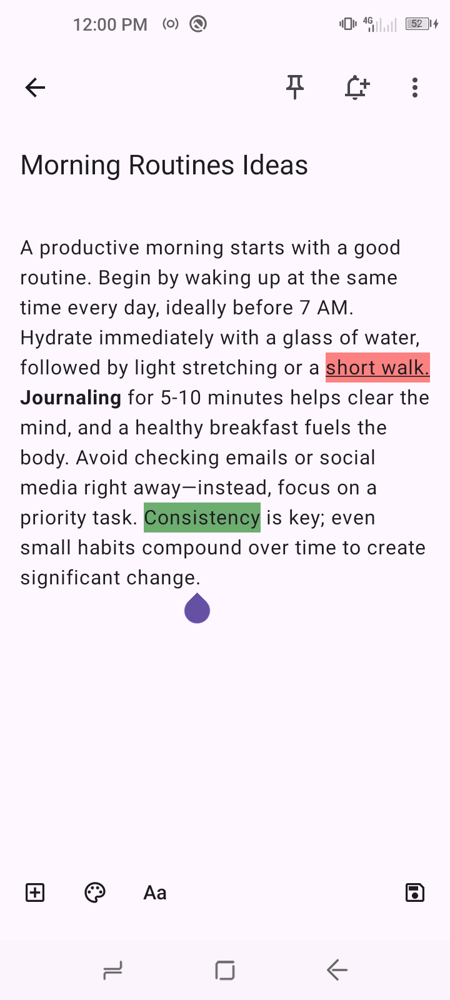
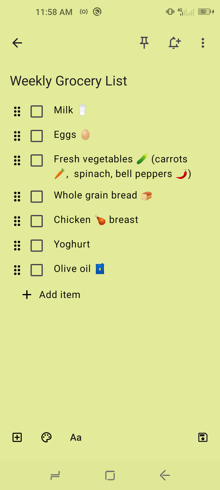
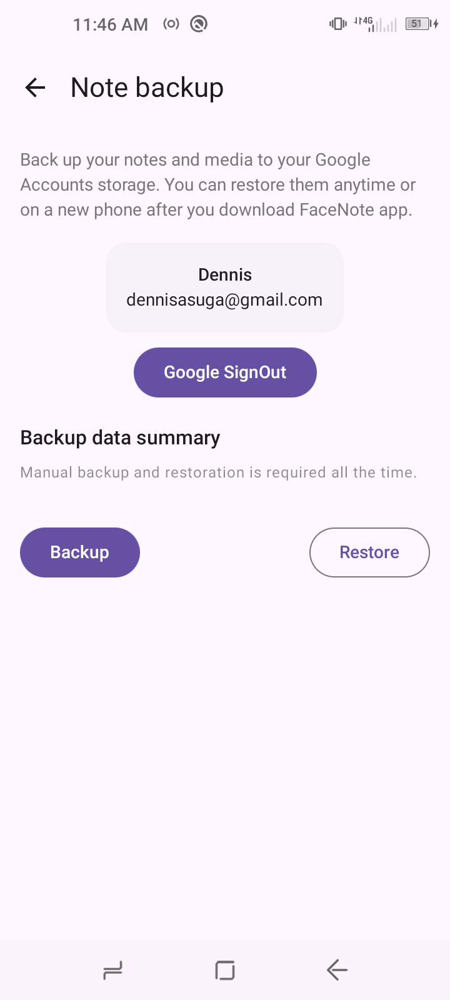
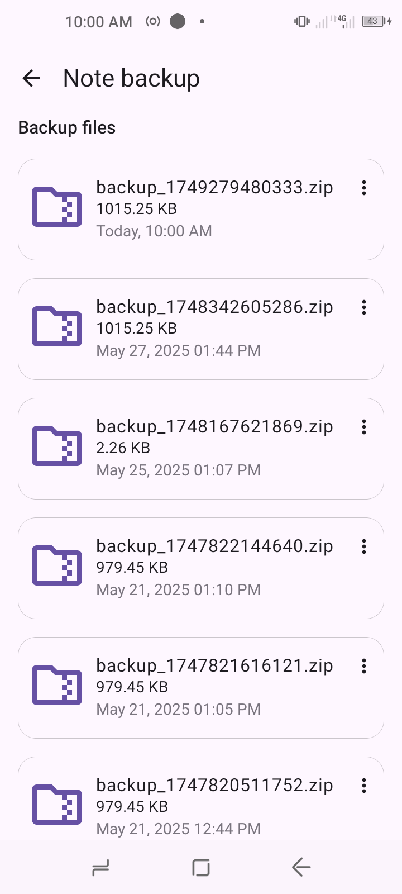
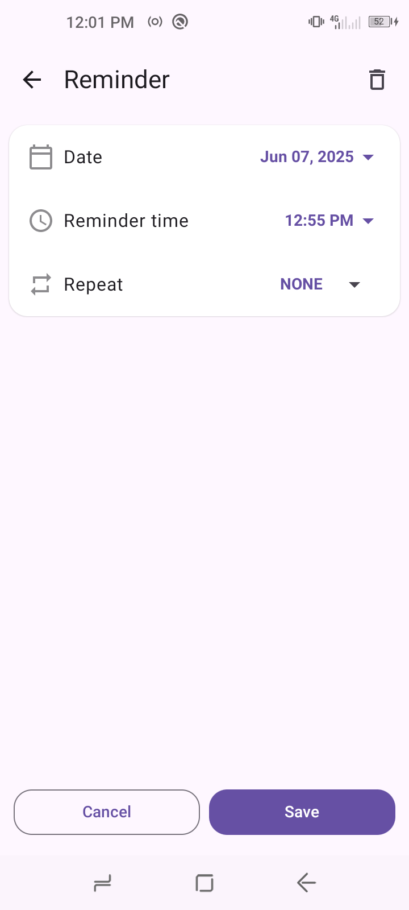
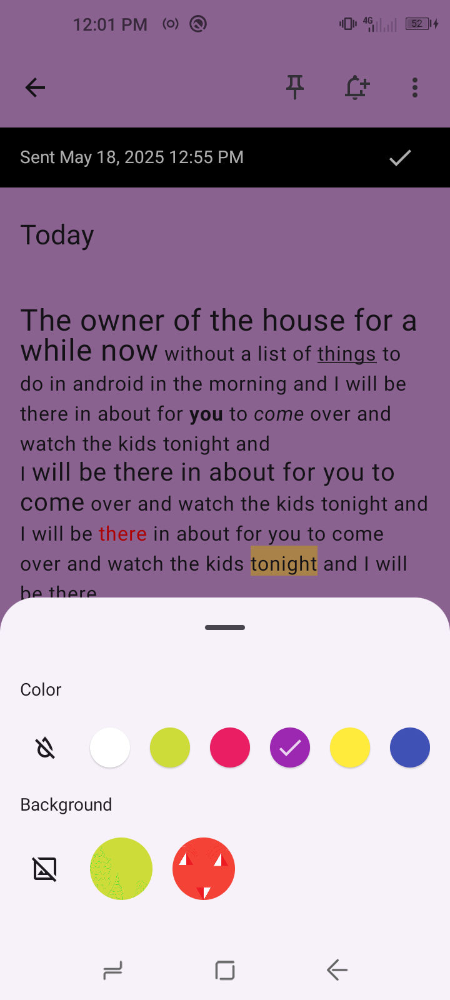
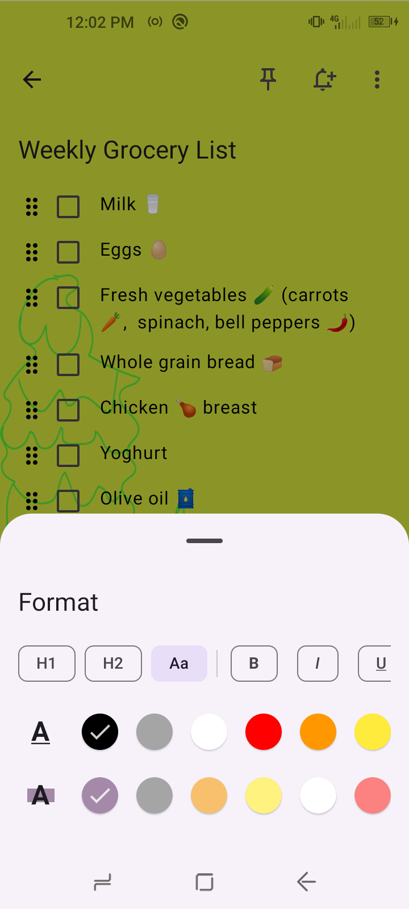

# FaceNote App

[](https://kotlinlang.org)
[](https://developer.android.com/jetpack/compose)
[](LICENSE)

**FaceNote** is a fully functional Android app built entirely with Kotlin and Jetpack Compose. It
follows Android design and development best practices and is intended to be a useful tool
for anyone who like to keep notes/todolist on daily basis.

## Key Features

**Core Functionality:**
- Notes/Todolist backup and restore  feature
- Reminder functionality
- Archive functionality
- Trash functionality
- RichText Editor functionality
- Note search & pinning
- Note Visual preference(Color/Image)
- Support checklist,text formatting and images

## Tech Stack and Libraries

**Architecture:**
- Clean Architecture (Data ➔ Domain ➔ Presentation)
- MVVM/MVI Pattern
- Use Cases (Business Logic Separation)
- Modules

**Libraries:**
- 🖼️ **UI**: Jetpack Compose, Material3
- 📡 **Storage**: RoomDatabase, SQLite3
- 💉 **DI**: Dagger Hilt
- 🔄 **Async**: Kotlin Coroutines, Flow
- 🖼️ **Image Loading**: Coil
- � **Navigation**: Compose Navigation
- 📦 **Persistence**: DataStore
- **Backup**: GoogleDrive

## Installation

**Prerequisites:**

- Android Studio Meerkat Feature Drop | 2024.3.2or later
- Android SDK 35+
- Java 17

**Steps:**
1. Clone the repository:
   ```bash
   git clone https://github.com/dennis-a-o/FaceNote.git
   ```
2. Open project in Android Studio
3. Build project (will resolve Gradle dependencies)
4. Run on emulator or physical device (min API 24)

## Screenshots

| Notes                                                  | Notes Navigation                                     | Note Text                                     |
|--------------------------------------------------------|------------------------------------------------------|-----------------------------------------------|
|                  |      |   |
| ------------------------------------------------------ | ---------------------------------------------------- | --------------------------------------------- |
| Note Checklist                                         | Backup                                               | Restore                                       |
| ------------------------------------------------------ | ---------------------------------------------------- | --------------------------------------------- |
|  |              |     |
|                                                        |                                                      |                                               |
| Reminder                                               | Background sheet                                     | Format sheet                                  |
| ------------------------------------------------------ | ---------------------------------------------------- | --------------------------------------------- |
|            |  |   |
|                                                        |                                                      |                                               |

## Project structure

```
📦 FaceNote App
├─ 📂 app # Main application module
├─ 📂 core # Core modules
│  ├─ 📂 data
│  ├─ 📂 database
│  ├─ 📂 datastore
│  ├─ 📂 domain
│  ├─ 📂 drive
│  ├─ 📂 model
│  ├─ 📂 navigation
│  ├─ 📂 notifications
│  ├─ 📂 storage
│  ├─ 📂 testing
│  ├─ 📂 ui
│  └─ 📂 worker
├─ 📂 feature # Feature modules
│  ├─ 📂 archive
│  ├─ 📂 backup
│  ├─ 📂 note-editor
│  ├─ 📂 note-gallery
│  ├─ 📂 note-search
│  ├─ 📂 notes
│  ├─ 📂 reminder
│  ├─ 📂 setting
│  └─ 📂 trash
├─ 📂 ui-test-hilt-manifest
└─ 📂 gradle
```

## Testing

To facilitate testing of components, **FaceNote** uses dependency injection with
[Hilt](https://developer.android.com/training/dependency-injection/hilt-android).
 
FaceNote uses [Roborazzi](https://github.com/takahirom/roborazzi) to run screenshot tests
of certain screens and UI components.

In instrumentation tests, a temporary folder is used to store the user's preferences, which is
wiped after each test.

## Contributing

1. Fork the project
2. Create your feature branch (`git checkout -b feature/AmazingFeature`)
3. Commit changes (`git commit -m 'Add some AmazingFeature'`)
4. Push to branch (`git push origin feature/AmazingFeature`)
5. Open a Pull Request

## License

Distributed under the MIT License. See [LICENSE](LICENSE) for more information.

## Acknowledgments

- Jetpack Compose Team
- Android Developers Community
- Retrofit & OkHttp Maintainers
- Dagger Hilt Team
- Coil Image Loading Library
- RoomDatabase Team


